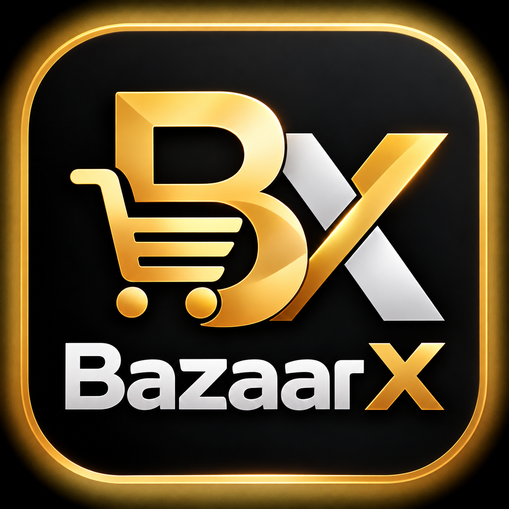

<p align="center">
  
</p>

<p align="center"><strong>Shop smarter. Live better.</strong><br />A multi-vendor marketplace for shoppers, independent sellers, and marketplace teams.</p>

<br />

BazaarX is a multi-vendor commerce platform for shoppers, independent sellers, and marketplace administrators. The first delivery is a responsive web MVP: buyers can discover products, save favorites, manage a cart, place a mock order, and view order history; sellers can review sales, manage listings and inventory, and fulfil orders; administrators can review marketplace activity, sellers, products, orders, and payments.

The experience follows the approved BazaarX direction: white surfaces, orange actions, navy type, rounded cards, restrained shadows, responsive layouts, and the BazaarX logo image supplied for this project. The code is organized as a small monorepo so six developers can work across buyer web, seller portal, admin portal, API, shared types/validation, and infrastructure without crowding one application folder.

## Product areas

- **Buyer marketplace** — home and category discovery, search, product details, wishlist, cart, sign-in/sign-up, account, checkout, payment selection, card demo, order confirmation, order history/details/tracking, returns/refunds, notifications, support tickets, and buyer–seller chat.
- **Seller center** — demo sign-in and onboarding, dashboard, product list, create/edit product, stock management, order list and fulfilment, returns, promotions, finance, payouts, analytics, store/account settings, and buyer messages.
- **Admin portal** — demo sign-in and dashboard, user and seller management, seller approval, product moderation, orders, payments, shipments, returns/refunds, promotions, vouchers, flash sales, campaigns, fraud/risk, support tickets, analytics, audit logs, and system settings.
- **API foundation** — NestJS health, catalog, mock authentication, checkout, payment, and inventory endpoints, with request validation and Swagger documentation.
- **Data model foundation** — Prisma schema and initial SQL migration for users, seller stores, catalog, inventory, carts, wishlists, orders, payment records, and status history.

## Phase delivery

- **Phase 0 — foundation:** workspace, role app shells, shared packages, design tokens, responsive layout foundations, local infrastructure configuration, API shell, and BazaarX logo.
- **Phase 1 — buyer identity:** mock customer login/signup and account basics; seller/admin demo logins.
- **Phase 2 — marketplace discovery:** home, search/category results, product details, wishlist, and cart.
- **Phase 3 — seller operations MVP:** seller identity/onboarding, dashboard, products, add/edit product, inventory, orders/fulfilment, returns, promotions, finance/payouts, analytics, store settings, and messages.
- **Phase 4 — admin operations MVP:** dashboard, users/sellers, seller approval, product moderation, order/payment/shipment management, returns/refunds, marketing, fraud/risk, support, analytics, audit logs, and settings.
- **Phase 5 — buyer service and purchase MVP:** checkout, address/delivery choices, voucher, payment selection/card demo, order confirmation/details/history/tracking, return/refund request, notifications, support center, and buyer–seller chat.
- **Phase 6 — delivery and after-sales:** shipment creation, courier scans, buyer tracking timeline, return request evidence, seller/admin review steps, and refund records.
- **Phase 7 — marketplace offers:** server-validated voucher rules, flash-sale stock and prices, campaign submissions, and admin activation controls.
- **Phase 8 — seller finance and analytics:** category commission rules, seller net proceeds, weekly settlement batches, seller performance reports, and marketplace totals.
- **Phase 9 — marketplace communication:** buyer–seller conversations, text and URL attachments, product/order references, read and typing states, in-app notifications, customer support tickets, admin replies, and ticket status updates.
- **Phase 10 — assisted discovery and listings:** natural-language product search, budget-aware shopping assistant, related product suggestions, product review summaries, seller listing copy drafts, and listing quality checks.

## Architecture

This npm-workspaces monorepo keeps portal screens separate so six developers can work across buyer, seller, admin, API, shared types, and platform setup:

```text
apps/
  web/       Vue 3 + TypeScript buyer storefront
  seller/    Vue 3 + TypeScript seller center
  admin/     Vue 3 + TypeScript operations portal
  api/       NestJS REST API and Prisma schema/migrations
packages/    shared TypeScript types and validation
docs/        local setup and team development notes
```

Each portal has its own views, router, services, and shell. API modules group endpoints by marketplace domain. Small frontend service modules own HTTP calls, and views call those services. Prisma models and SQL migrations document the persistent data shape.

Phase 9 chat uses Socket.IO events for live messages, typing, and read receipts, with a 30-second REST refresh when a socket disconnects. The demo does not authenticate socket participants. Image uploads accept JPG, PNG, and WebP files up to 5 MB and save them locally under `apps/api/uploads`. Email, SMS, and push channels can POST to provider webhooks configured through `.env.example`.

Phase 10 uses a deterministic local mock AI provider behind a provider interface. It searches seeded catalog products and returns generated demo review summaries without calling an external model. Replace the provider and review source before relying on generated copy or sentiment for live listings.

## Run locally

Use Node.js 20+ and npm 10+.

```sh
npm install
npm run dev          # buyer app at http://localhost:5173
npm run dev:seller   # seller center at http://localhost:5174
npm run dev:admin    # admin portal at http://localhost:5175
npm run dev:api      # API at http://localhost:3001/api/v1
```

Copy `.env.example` to `.env` at the repository root to connect all three portals to the API. By default, mutable demo records are stored as JSON under `apps/api/var/state`, so they survive restarts on one host. Set `MARKETPLACE_STATE_DIR` to a persistent writable volume when running the API. To use PostgreSQL, set `PERSISTENCE_DRIVER=postgres`, configure `DATABASE_URL`, then run `npm run db:deploy --workspace @bazaarx/api` before starting the API. This adapter saves records in the `ApiState` JSON table; normalized Prisma models document the target data shape. The file adapter is for a single API process.

The buyer app uses browser local storage for its demo flow by default. With the root `.env` configured, implemented buyer, seller, and admin flows use the shared API. API catalog records and browser demo products are seeded separately. Login is a front-end demo; API routes do not enforce authentication or role authorization. AI uses a deterministic local provider. Production authentication, cloud image storage, real AI/payment providers, and courier integrations still need deployment credentials and configuration.

Before sharing a build, run `npm run type-check` and `npm run build` from the repository root. Open `http://localhost:3001/api/docs` while the API is running to inspect the API documentation.

Demo checkout voucher: `BAZAARX10` (10% off, PKR 10,000 minimum subtotal, up to PKR 5,000 discount).

See [development notes](docs/development.md) for the team folder boundaries and local setup details. Configure local secrets using `.env.example`; do not commit credentials.
